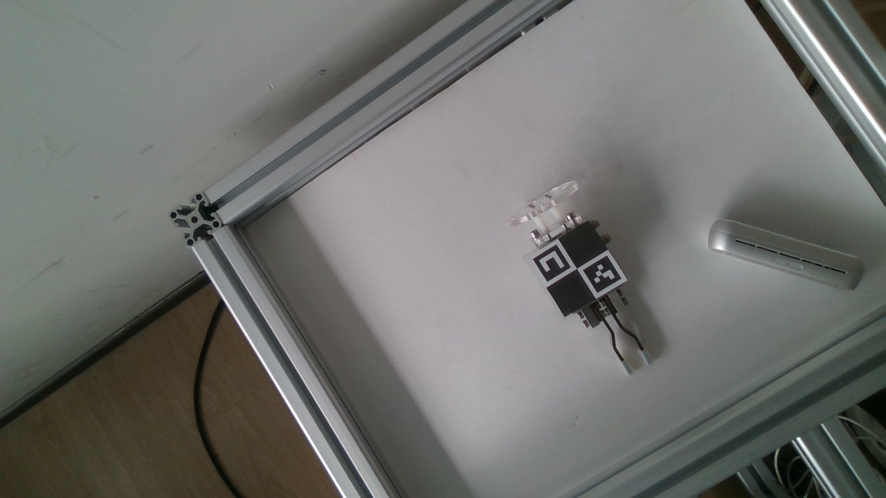

## Overview
The data in this repository is for the paper “Hand-eye Parameter Estimation Based on 3D Observation of A Single Marker”. It includes four sets of hand eye calibration data, i.e., single-marker data and pattern data in eye-in-hand configuration and in eye-to-base configuration. Please refer to the reference article for details.

## Setup

### eye-in-hand
``camera``: Intel Realsense D415;

``robot``: Jaka Zu7;

``target``: 4 × 6 ChArUco pattern or and 1 × 1 ChArUco


**_Figure_**:The eye-in-hand configuration using the grid pattern (a), using the single marker (b), and the camera poses relative to the pattern (c).

### eye-in-hand
``camera``: RVC-X mini

``robot``: Jaka Zu7

``target``: 4 × 6 ChArUco pattern or and 1 × 1 ChArUco


**_Figure_**:The eye-to-base configuration using the grid pattern (a), using the single marker (b), and the pattern poses relative to the camera (c).

## File
Each dataset contains four folders as follows.
``image``: images captured by the camera.


``imageUndistort``:  Undistorted images with recognized corners


``pc``: Point clouds captured by 3D cameras


``pointCode``: Number and 3D position (mm) of ArUcos
```
14 131.10023137487286 23.3593419551042 531.7328785405564
10 89.96901821050616 14.214530069864374 538.3700191889442
```

``pointUndistort``: Number, 3D position (mm), and 2D pixels of corners
```
0 108.65124582419413 18.6479941886997 524.650560088468
0 833.0937 388.00687 0
```

``robot``: The pose (x (mm), y (mm), z (mm), roll (radian), pitch (radian), yaw (radian)) executed by the robot. 
```
20.89178 -443.14578 545.78949 -2.237171200091789 0.7151100770297445 2.1129048066671
55.84477 -376.25533 544.3847 -2.2281153848893664 0.7270383550660999 2.1927345944952443
```

## Reference
Jin, G., Yu, X., Chen, Y., Li, J. (2023), Hand-eye Parameter Estimation Based on 3D Observation of A Single Marker, submitted to IEEE Trans. Instrum. Meas.
         
## Code
The  associated  codes can be downloaded on https://github.com/MatthewJin001/Single3D

## Contact

Gumin Jin, Department of Automation, Shanghai Jiao Tong University, Shanghai, jingumin@sjtu.edu.cn


